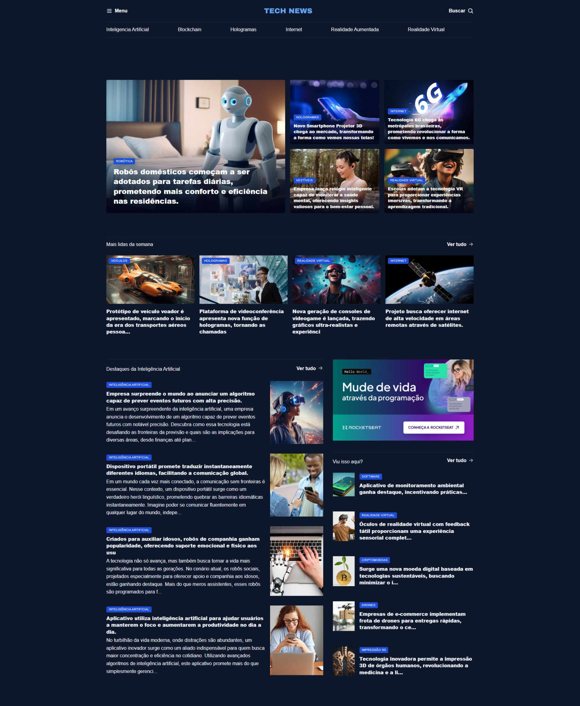

# 📰 Projeto: TechNew

## 🚀 Descrição

Projeto desenvolvido durante o curso Full Stack da Rocketseat (180h).
Este repositório apresenta uma landing page responsiva de uma newsletter de tecnologia, com foco em layout moderno, boas práticas de HTML semântico e CSS organizado.
Tem como objetivo exercitar fundamentos de estruturação, estilização e responsividade de páginas web.

## 📸 Preview

Você pode visualizar o layout original no Figma:  
[🔗 Local Turístico - Style Guide (Figma)](https://www.figma.com/community/file/1362166020452569562/portal-de-noticias)

## 🛠️ Tecnologias Utilizadas

- HTML5
- CSS3

## 📂 Estrutura do Projeto

📁 TechNew/
├── assets
│ ├── icons
│ ├── imgs
├── styles
├── index.html
├── resultadoTechNews.png
└── README.md

🧪 Como executar o projeto
Clone o repositório:
git clone https://github.com/LucasValada/TechNew.git
cd TechNew

Abra o arquivo index.html no navegador:
Clique duas vezes sobre ele OU
Use a extensão Live Server no VSCode.
